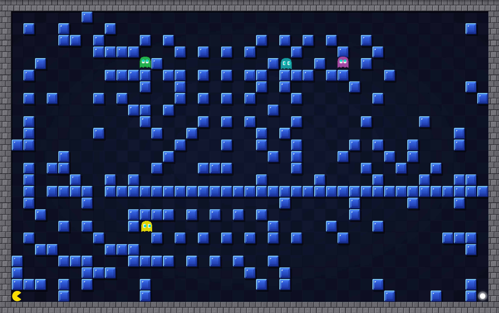

# Pacmaze

Recriação em Godot do Pacmaze, um dos jogos do projeto [Ludum pro bono](https://github.com/lumac-ufsm/ludum-pro-bono-games), originalmente feito em Unity.

O jogador conduz o pac por um labirinto até a pílula branca. Depois que se escolhe uma direção, o pac desliza até bater num obstáculo. No caminho é preciso evitar os fantasmas e usar os portais.

### ▶️ [Jogar agora no navegador](https://luanws.github.io/pacmaze/)

Não precisa instalar nada: o link abre o jogo direto no navegador, e dá para jogar com teclado ou controle.

## Controles

| Teclado | Controle | Ação |
| --- | --- | --- |
| Setas | Direcional / analógico esquerdo | Movimentam o pac |
| Seta contra uma porta | Direção contra uma porta | Abre a porta, se o pac tiver a chave da mesma cor |
| `Espaço` | `Y` / triângulo | Volta o pac ao início da fase |
| `Esc` / `P` | `Start` | Pausa |
| `F11` / `Alt+Enter` | | Alterna entre tela cheia e janela |
| `M` | `Select` / `Back` | Liga e desliga o som e a música |

Nos menus, o controle navega com o direcional, confirma com `A` e volta com `B`. O editor de fases precisa de mouse, mas o `B` do controle sai dele e volta ao menu principal. Na versão web, o navegador só reconhece o controle depois que algum botão dele é apertado com a página aberta.

## Elementos das fases

- **Paredes**: param o pac. Há vários estilos de bloco, do clássico ao neon, tijolo, gelo, lava e doce.
- **Fantasmas**: fazem rondas fixas pelo labirinto. Encostar num deles custa a tentativa, então é preciso esperar a hora certa de passar.
- **Portais**: entrar em um leva ao outro, e os dois trocam de lugar.
- **Chaves e portas**: a porta bloqueia o pac como uma parede. Passando pela chave, o pac a guarda, e ela aparece no topo da tela. Para abrir a porta, o pac precisa estar parado ao lado dela e apertar a seta na direção dela.
- **Caixotes**: param o pac como qualquer parede, mas se ele encostar num deles parado, o caixote anda uma casa e o pac ocupa o lugar dele. Empurrar é o único jeito de andar uma casa só, e um caixote bem posicionado vira o freio que deixa o pac parar na coluna ou linha certa.

Quando o pac morre ou volta ao início, as chaves, as portas e os caixotes voltam ao lugar.

## Editor de fases

No menu principal, o **Editor de fases** permite desenhar paredes, posicionar o pac, a pílula, os fantasmas (com as rotas), os portais, os caixotes e as chaves com suas portas, salvar e testar a fase sem sair do jogo. As fases criadas aparecem em **Selecionar fase → Fases criadas**.

## Créditos

- A música e os efeitos sonoros são sintetizados pelo próprio jogo. Cada fase tem a sua trilha, que fica em loop do começo ao fim dela.
- As imagens da chave e do cadeado são dos pacotes *Game Icons* e *Game Icons Expansion*, da [Kenney](https://kenney.nl), publicados sob a licença [CC0](https://creativecommons.org/publicdomain/zero/1.0/).
